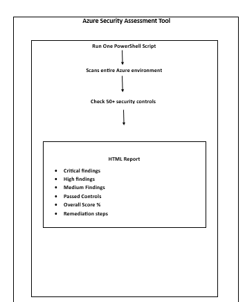

# 🔐 Azure Security Assessment Tool

## Architecture

## Overview

This project documents the design and
development of a custom PowerShell-based
security assessment engine that scans
50+ security controls across six domains
in a hybrid Azure environment and
generates executive-level HTML compliance
reports with interactive filtering,
remediation guidance, and trend tracking.

Security assessment tools exist in two
forms. Commercial tools — Tenable, Qualys,
Rapid7 — provide comprehensive scanning
capability at significant cost and with
significant operational overhead. Built-in
platform tools — Defender for Cloud,
Azure Policy compliance — provide coverage
within their specific scope but require
navigation across multiple portals to
assemble a complete picture.

Neither approach answers the question that
matters most to security leadership: in
plain language, right now, how secure are
we and what are the three things we should
fix first?

This tool answers that question in a single
automated run, producing a report that
a security engineer can act on and a
business leader can understand.

---

## The Problem This Solves

Security teams in hybrid environments
typically maintain security posture
information across multiple systems.
Defender for Cloud holds cloud security
recommendations. Active Directory
administrative tools hold on-premises
configuration data. Azure Policy
compliance holds governance status.
Log Analytics holds security event
trends. No single view combines them.

Assembling a complete security posture
report manually requires pulling data
from each system, normalising it into
a consistent format, applying a
severity framework, prioritising
findings, and producing a document
that communicates clearly to both
technical and non-technical audiences.
This process takes hours when done
manually. It is frequently skipped
because of that cost. Security posture
reviews that should happen weekly happen
quarterly. Quarterly reviews that should
drive remediation are forgotten by the
time the next review occurs.

Automation solves this. A tool that
produces a complete, accurate, and
consistently formatted security posture
report in minutes removes the cost
barrier to frequent assessment. Weekly
posture reviews become practical.
Remediation progress becomes visible
between reviews rather than only at
the next formal assessment.

---

## Architecture

ASSESSMENT ENGINE
════════════════════════════════════════

PowerShell Assessment Engine
- │
- ├── MODULE 1: Identity & Access
- │   ├── Global Admin count
- │   ├── MFA registration status
- │   ├── Guest user review
- │   ├── Service principal secrets expiry
- │   ├── PIM configuration status
- │   ├── Conditional Access coverage
- │   └── Stale account detection
- │
- ├── MODULE 2: Network Security
- │   ├── VNet configuration
- │   ├── NSG deny-all baseline
- │   ├── Public IP exposure
- │   ├── Azure Firewall status
- │   ├── Private endpoint coverage
- │   ├── Network Watcher status
- │   └── Flow log configuration
- │
- ├── MODULE 3: Data Protection
- │   ├── Storage account public access
- │   ├── Storage secure transfer
- │   ├── Key Vault public access
- │   ├── Key Vault soft delete
- │   ├── Key Vault purge protection
- │   ├── SQL TDE status
- │   └── Encryption key management
- │
- ├── MODULE 4: Security Operations
- │   ├── Defender for Cloud plans
- │   ├── Secure Score
- │   ├── Sentinel status
- │   ├── Log Analytics retention
- │   ├── Arc agent connectivity
- │   ├── Security contacts
- │   └── Auto provisioning
- │
- ├── MODULE 5: Governance
- │   ├── Management Group structure
- │   ├── Policy assignment coverage
- │   ├── RBAC custom roles
- │   ├── Resource locks
- │   ├── Tag compliance
- │   ├── Subscription access review
- │   └── Blueprint assignments
- │
- ├── MODULE 6: Hybrid Infrastructure
- │   ├── Arc server health
- │   ├── Arc extension status
- │   ├── AAD Connect sync health
- │   ├── DC security baseline
- │   ├── Audit policy configuration
- │   └── Domain admin count
- │
- └── REPORT GENERATOR
    - ├── Executive summary
    - ├── Score by category
    - ├── Critical findings table
    - ├── Remediation priority list
    - ├── Trend comparison (if history)
    - └── Interactive HTML output

---

## Why Build a Custom Tool

The question worth addressing directly
is why build a custom assessment tool
when Defender for Cloud already provides
security recommendations and a Secure
Score.

Defender for Cloud is excellent at what
it does. It assesses Azure resources
against a comprehensive control framework
and surfaces recommendations clearly.
It does not assess on-premises
infrastructure beyond what Arc exposes.
It does not assess Active Directory
configuration. It does not assess Azure
AD Connect health. It does not combine
its findings with custom organisational
controls that are important for a specific
environment but not part of the Azure
Security Benchmark.

The custom tool fills those gaps. It
assesses the complete hybrid environment
including the components that no built-in
tool covers. It applies a consistent
scoring framework across all components
— cloud and on-premises — producing a
single score that reflects the true
security posture of the environment as
a whole.

There is also a professional development
dimension. Building a security assessment
tool requires understanding every control
it assesses. Writing the check for
whether MFA is enforced for all users
requires understanding the Conditional
Access policy model well enough to query
it programmatically. Writing the check
for whether Key Vault purge protection
is enabled requires understanding the
Key Vault security model. The process
of building the tool deepens the
understanding of every security domain
it covers.

---

## Control Framework Design

The 50+ controls assessed by this tool
were selected against three criteria.

The first criterion was relevance. Every
control assessed must be directly
applicable to this environment. Controls
that reference services not deployed
generate noise rather than insight.
The tool assesses what exists, not what
could exist.

The second criterion was actionability.
Every failing control must have a clear
remediation path. A control that flags
a problem without providing a resolution
direction creates frustration rather
than improvement. Each control in the
tool includes a remediation description
that explains specifically what must
be done to move from failing to passing.

The third criterion was severity
calibration. Not all security controls
are equally important. A finding that
exposes the organisation to immediate
compromise must be weighted differently
from a finding that represents a
configuration best practice. The tool
assigns severity — Critical, High,
Medium, Low — based on the potential
impact of the control failing and the
likelihood that the failure would be
exploited.

The severity distribution across the
control set was designed to reflect
real-world security prioritisation.
A tool that classifies every finding
as Critical produces a report that
cannot be prioritised. A tool with
calibrated severity produces a clear
signal about what requires immediate
action versus what can be addressed
in the next planned maintenance window.

---

## The Scoring Model

Each control contributes to an overall
security score weighted by severity.

SCORING WEIGHTS:
Critical controls: 10 points each
High controls:      5 points each
Medium controls:    3 points each
Low controls:       1 point each

SCORE CALCULATION:
Score = (Points earned / Total possible points) × 100

CATEGORY SCORES:
Each module calculates its own score
using the same weighted formula

OVERALL SCORE:
Weighted average of all six module scores
with module weights reflecting relative
security importance

This weighted approach means that
passing all Low controls while failing
Critical controls does not produce
a misleadingly high score. The Critical
control failures suppress the score
appropriately, reflecting the actual
risk posture of the environment.

The score is not the point. The point
is what drives the score. A score of
72% is meaningful only because the
report shows exactly which 28% of
controls are failing, why they are
failing, and what must be done to
pass them.

---

## Report Design

The report was designed with two
audiences in mind simultaneously.

The security engineer audience needs
technical detail — exactly which
controls are failing, the specific
configuration that needs to change,
and the PowerShell or portal steps
to remediate. They need to be able
to act on the report immediately
without additional research.

The security leadership audience needs
strategic clarity — overall posture,
trend direction, top priorities, and
business risk context. They need to
understand the security story without
reading technical configuration details.

A single report serves both audiences
by separating the summary view from
the detail view. The executive summary
leads with the overall score, the trend
since the last assessment, and the top
three findings requiring immediate
attention. The detail section provides
the technical information for each
finding. Leadership reads the summary.
Engineers read the detail. Both find
what they need in one document.

The report is generated as a self-
contained HTML file with no external
dependencies. It can be emailed, stored
in SharePoint, attached to a ticket,
or opened offline. No server is required
to render it. No network connection is
needed to view it. The report works
anywhere.

Interactive filtering was implemented
using JavaScript embedded in the report.
An engineer reviewing findings can
filter to show only Critical findings,
or only findings in the Network Security
category, or only findings that have
changed since the last assessment.
This filtering capability transforms
the report from a static document into
a working tool for remediation planning.

---

## Assessment Engine Implementation

The engine is implemented as a
PowerShell module with a clear
separation between data collection,
analysis, and presentation.

Data collection functions query Azure
APIs and on-premises systems using the
Az PowerShell module and direct AD
queries. Each function returns a
structured object representing the
result of a single control check —
the control name, the result, the
evidence, and the remediation
description.

Analysis functions aggregate control
results into module scores, identify
trend changes by comparing against
the previous assessment file if one
exists, and generate the priority
list by sorting failing controls by
severity and estimated remediation
effort.

The presentation layer takes the
analysis output and renders the HTML
report. The HTML template is embedded
in the PowerShell module — the tool
has no external template file
dependency. A single script file is
the complete tool.

powershell
# Simplified assessment execution flow

# Collect results across all modules
$identityResults  = Invoke-IdentityAssessment
$networkResults   = Invoke-NetworkAssessment
$dataResults      = Invoke-DataAssessment
$secOpsResults    = Invoke-SecOpsAssessment
$governanceResults= Invoke-GovernanceAssessment
$hybridResults    = Invoke-HybridAssessment

# Aggregate and score
$allResults = @(
    $identityResults
    $networkResults
    $dataResults
    $secOpsResults
    $governanceResults
    $hybridResults
)

$assessment = Get-AssessmentScore -Results $allResults

# Compare with previous run
$previousAssessment = Get-PreviousAssessment
$trends = Get-AssessmentTrends `
    -Current $assessment `
    -Previous $previousAssessment

# Generate report
New-SecurityAssessmentReport `
    -Assessment $assessment `
    -Trends $trends `
    -OutputPath ".\reports\assessment-$(
        Get-Date -Format 'yyyyMMdd'
    ).html"

---

## Running the Assessment

The tool is designed to run with
minimal prerequisites. An Az PowerShell
session authenticated to the target
subscription and RSAT tools for
Active Directory query capability
are the only requirements.

powershell
# Connect to Azure
Connect-AzAccount

# Connect to Microsoft Graph
Connect-MgGraph -Scopes `
    "Directory.Read.All",
    "Policy.Read.All",
    "IdentityRiskyUser.Read.All"

# Run full assessment
.\Invoke-SecurityAssessment.ps1 `
    -OutputPath ".\reports\" `
    -IncludeHybrid `
    -ComparePrevious `
    -Verbose

# Output:
# Assessment complete
# Overall Score: 74%
# Critical findings: 0
# High findings: 4
# Medium findings: 12
# Low findings: 8
# Report saved: .\reports\assessment-20260601.html

A full assessment across all six
modules completes in approximately
four minutes on a standard Azure
subscription with the environment
size documented in this portfolio.
The time is dominated by Azure API
response times rather than local
processing.

---

## Integration with the Portfolio

The assessment tool was designed
from the outset to assess the
specific environment built across
this 14-project portfolio. Each
project adds controls to the
assessment scope.

After Project 1 the SOC Operations
module gains meaningful results as
Defender for Cloud and Sentinel are
operational. After Project 2 the
Identity module gains full coverage
as Conditional Access and PIM are
configured. After Project 3 the
Network module gains full coverage
as Hub-Spoke and NSGs are deployed.
After Project 4 the Data module
gains full coverage as private
endpoints are in place.

Running the assessment after each
project documents the improvement
in security posture that the project
delivers. The trend comparison feature
shows the score improvement between
runs. Over the course of all 14
projects the assessment output
tells the story of a security programme
that progresses systematically from
a baseline of 21.79% to a mature
posture exceeding 85%.

This progression — documented through
assessment reports — is more compelling
evidence of security engineering
capability than any individual project
or certification. It demonstrates
not just that security controls can
be implemented but that security
posture can be measured, tracked,
and improved systematically.

---

## Challenges Encountered

*API rate limiting*

Running 50+ control checks in rapid
succession against Azure APIs
occasionally triggered rate limiting
responses — HTTP 429 errors with
Retry-After headers. The engine
was updated to handle these responses
by implementing exponential backoff
retry logic — waiting for the period
specified in the Retry-After header
before retrying, with an increasing
wait time for subsequent failures.
This is standard practice for any
tool that queries cloud APIs at volume
but it is not obvious to engineers
who have not encountered rate limiting
in practice.

*Consistent results across runs*

Early versions of the tool produced
slightly different scores on consecutive
runs of the same unchanged environment
because some API responses are
eventually consistent — they reflect
the state of the system at the time
of the API call and may not immediately
reflect recent changes. The solution
was to add a stabilisation delay after
any configuration change before running
an assessment, and to document that
assessment results represent a point-
in-time snapshot rather than a real-
time view.

*On-premises query from cloud context*

Some hybrid assessment controls query
Active Directory directly — checking
domain admin count, audit policy
configuration, and DC security settings.
These queries require the assessment
to run from a context that can reach
the Domain Controller, not from a
cloud-only environment. The tool
includes a detection step that
identifies whether the Active Directory
module is available and gracefully
degrades the hybrid assessment to
Azure-only if it is not — ensuring
the tool is useful in pure cloud
contexts as well as hybrid ones.

---

## Lessons Learned

The most valuable lesson from building
this tool was about the relationship
between automation and understanding.

It is not possible to write a reliable
automated check for a security control
without deeply understanding that
control. Writing the Conditional Access
coverage check required understanding
exactly what constitutes complete CA
coverage — which users must be included,
which exclusions are acceptable, which
cloud apps must be covered. The act
of writing the check surfaced gaps in
that understanding that reading
documentation alone had not revealed.

Building security tools is one of
the most effective ways to develop
security knowledge — not because
the tool itself teaches the concepts
but because the requirement to express
the concepts as precise programmatic
logic forces a level of understanding
that conceptual knowledge does not
require.

The second lesson was about the
organisational value of consistency.
A manually produced assessment report
varies in structure, detail level, and
severity calibration based on who
produces it and when. An automated
report is identical in structure every
time. This consistency means that
month-over-month comparison is
meaningful — differences in the report
reflect differences in the environment,
not differences in how the report
was produced.

---

## What I Would Do Differently at Scale

At enterprise scale the assessment
engine would be deployed as an Azure
Function — running on a schedule,
storing results in Azure Table Storage,
and posting summaries to a Teams
channel. The report would be generated
on demand through a Power Apps
interface, allowing non-technical
stakeholders to request and view the
latest assessment without PowerShell
access.

The control framework would be extended
to support custom controls defined in
a JSON configuration file, allowing
each organisation to add controls
specific to their regulatory environment
without modifying the core engine code.

Integration with ticketing systems —
ServiceNow, Jira — would automate
the creation of remediation tickets
for new findings, assigning them to
the appropriate team based on the
finding category and linking the
ticket to the assessment report
for traceability.

---

Uzma Shabbir
Azure Security Engineer | AZ-104 | AZ-500
[GitHub](https://github.com/UzmaSami) •
[LinkedIn](https://linkedin.com/in/uzma-shabbir-034361128)
